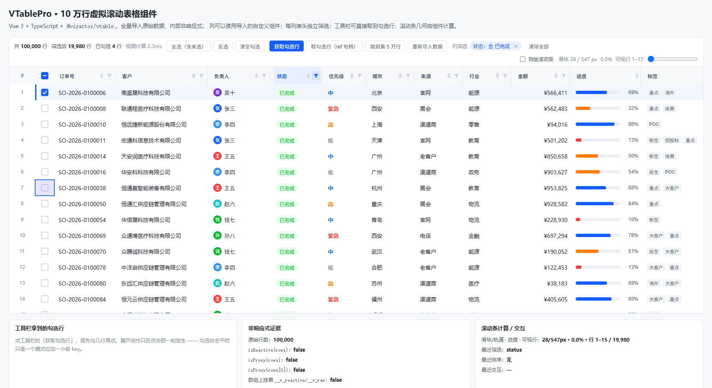
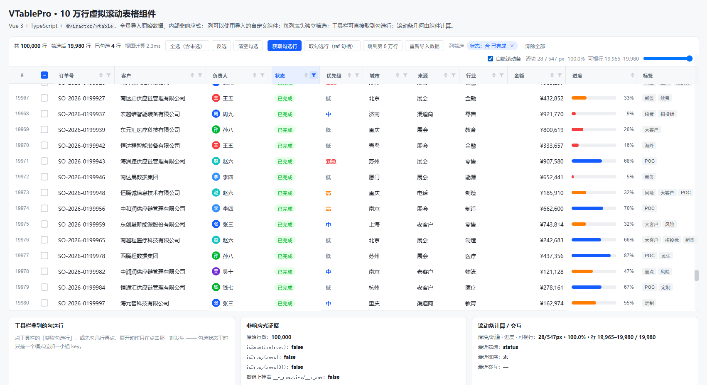
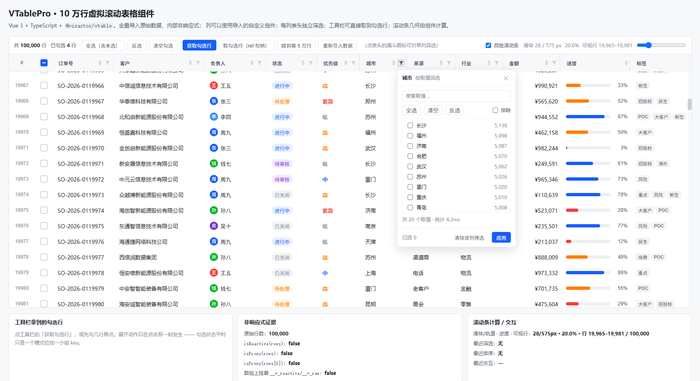
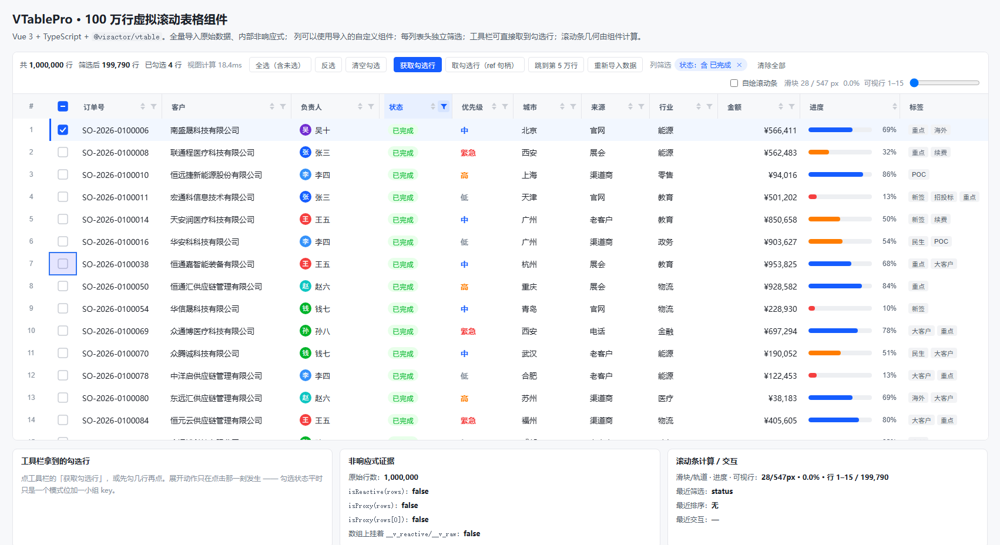

# VTablePro · 虚拟滚动表格组件（Vue 3 + TypeScript + `@visactor/vtable`）

一个可复用的表格组件：**全量导入原始数据、内部非响应式**、**列可以用导入的自定义组件**、
**每列表头独立筛选**、**工具栏直接取勾选行**、**滚动条几何自己算**、
**10 万行 52 FPS，100 万行 52 FPS，200 万行 45 FPS**（500 万行仍可用，见 §7）。

```bash
npm install
npm run dev        # http://127.0.0.1:5277/      加 ?rows=1000000 换数据量
npm run typecheck  # vue-tsc --noEmit
npm run build      # vue-tsc --noEmit && vite build
npm run probe      # 无人值守渲染回归探针（需 dev server 在跑）→ 50 项断言
npm run bench      # 性能基准：滚动 FPS / 关键路径耗时 / 内存
npm run scale      # 规模曲线：10 万 / 100 万 / 200 万 行对照
```

> 行数用 URL 参数控制：`http://127.0.0.1:5277/?rows=1000000`。
> 探针和基准也吃这个参数 —— 同一套 50 项断言可以原样跑到百万级：
> `node tools/probe.mjs 'http://127.0.0.1:5277/?rows=1000000'`。



---

## 0. 需求 → 实现对照

| 需求 | 落在哪 | 关键点 |
| --- | --- | --- |
| 支持虚拟滚动 | VTable `ListTable` | 行高列宽全给死值（`heightMode/widthMode: standard`），只画可视区；可视区间通过 `getBodyVisibleRowRange()` 暴露 |
| **全量导入原始数据，内部不用响应式** | `lib/BulkData.ts` | `toRaw()` + `markRaw()`，只交接引用；索引 / 值域统计按需构建并缓存；组件侧用「tick + 命令式句柄」而不是把数据塞进依赖图 |
| **不同列用导入的自定义组件** | `lib/columns.ts` + `VTableVueAttributePlugin` | 列上声明 `cell: { component }`，走 VTable 官方 DOM 覆盖层；没声明的列留在 canvas 文本快路径 |
| **计算滚动条** | `lib/scroll.ts` | `computeScrollMetrics()` 从公开读数算出滑块高 / 滑块位置 / 轨道 / 可视行区间；`<ProScrollbar>` 用这些数渲染并支持拖拽反算 `scrollTop` |
| **工具栏能拿到勾选行** | `lib/ProToolbar.vue` + `lib/context.ts` | 工具栏 inject 组件句柄，点「获取勾选行」才把勾选展开成数组（`selection-change` 里也故意给的是 getter） |
| **每列表头单独筛选** | `lib/ProHeaderCell.vue` + `lib/ColumnFilterPopover.vue` + `lib/filters.ts` | 表头是 DOM 组件（真按钮 + 稳定锚点），漏斗开该列弹窗；取值型 / 关键字型自动选择，多列 AND 叠加 |
| **10 万行滚动不卡** | 见 §4 实测 | 100 万行同样 52 FPS、0 卡顿帧；2 万到 500 万的曲线见 §7 |

---

## 1. 用法

```vue
<script setup lang="ts">
import { ref } from 'vue';
import { VTablePro, type ProColumn, type ScrollMetrics } from './lib';
import OwnerCell from './cells/OwnerCell.vue';   // 任意导入的 Vue 组件

const columns: ProColumn[] = [
  { field: 'orderNo', title: '订单号', width: 150, filterKind: 'text' },
  { field: 'status',  title: '状态',   width: 124, filterKind: 'options',
    cell: { component: StatusCell } },                       // ← 这一列用组件渲染
  { field: 'owner',   title: '负责人', width: 150, cell: { component: OwnerCell } },
  { field: 'actions', title: '操作',   width: 140, sortable: false, filterable: false,
    cell: { component: ActionsCell, interactive: true,       // ← 有按钮就必须打开
            props: ctx => ({ onAction: handle }) } },
];

// 普通数组：不要包 ref / reactive（包了也不会被代理，见 §2.1，但没必要）
const rows = makeRows(100_000);
</script>

<template>
  <VTablePro :columns="columns" :data="rows" :height="660" selectable
             @selection-query="rows => (picked = rows)">
    <template #toolbar-actions>
      <!-- 插槽里的按钮用组件 ref 句柄；工具栏自带的按钮走 inject，二者等价 -->
      <button @click="pro?.getCheckedRows()">导出勾选行</button>
    </template>
  </VTablePro>
</template>
```

### Props

| prop | 类型 | 默认 | 说明 |
| --- | --- | --- | --- |
| `columns` | `ProColumn[]` | — | 列定义（**保持引用稳定**，变更即重建列） |
| `data` | `Row[]` | — | 全量原始数据（按引用比较，绝不做 deep watch） |
| `rowKey` | `string \| (row) => RowKey` | `'id'` | 行唯一键 |
| `height` | `number \| string` | `620` | 组件总高（工具栏 + 表格） |
| `rowHeight` / `headerHeight` | `number` | `38` / `42` | 固定行高，虚拟滚动的前提 |
| `selectable` | `boolean` | `true` | 是否带勾选列（canvas 自绘，冻结在左侧） |
| `customScrollbar` | `boolean` | `false` | 用计算出来的自绘滚动条替换 canvas 上那条 |

### 事件

`update:selectedKeys`（仅在传了该 prop 时触发）、`selection-change`、`filter-change`、`sort-change`、
`scroll(metrics)`、`row-click`、`selection-query(rows)`、`update:customScrollbar`。

### 暴露的句柄（`defineExpose` / `useProTable()`）

```ts
setData(rows)  getData()  getFilteredData()  getLastViewMs()
getCheckedRows()  getCheckedKeys()  getSelectionCount()  isChecked()  setChecked()
selectAll()  invertSelection()  clearSelection()
setFilter(field, filter)  getFilters()  clearFilters()  getColumnDomain(field)
setSort(s)  getSort()
scrollToRow(i)  scrollToTop()  getScrollMetrics()  scrollToProgress(p, axis?)
subscribe(topic => void)   // 'data' | 'selection' | 'scroll' | 'header-sync'
table                      // 底层 ListTable 逃生舱
```

> `useProTable()` 只能在 `<VTablePro>` **内部**的组件树里用（工具栏、被子组件渲染的插槽内容）。
> 父组件模板里直接写在 `<template #toolbar-actions>` 的按钮，其实是在父组件的 setup 作用域里求值的，
> inject 找不到 —— 那种情况用组件 `ref` 拿句柄。

---

## 2. 六个关键设计

### 2.1 数据层：全量导入，但绝不进响应式

`BulkData.setRows()` 只做两件事：`markRaw(toRaw(rows))` 然后换引用，**不遍历**。

```ts
setRows(rows) {
  const raw = markRaw(toRaw(rows));   // ref 里的 Proxy → 原始对象；并标记「别再代理我」
  this._rows = raw; this._view = raw; this.invalidate();
}
```

三道保险：

1. `toRaw()`：调用方传 `ref([...]).value` 也能拿到原始数组；
2. `markRaw()`：数组被打上 `__v_skip`，**任何** `reactive()` 都会原样返回它（对照实验里就撞上了这点）；
3. 组件内部只把**小对象**放进 `ref`（计数、筛选状态、滚动几何），行数据永远走普通变量。

代价有多真实？同一批 10 万行，逐行读一遍属性：

| 读法 | 耗时（6 次取最小） | 相对 |
| --- | --- | --- |
| 原始对象数组 | **0.4 ms** | 1× |
| `reactive()` 代理后 | **58.7 ms** | **147×** |

内存上 Proxy 只多付 4.2MB（Vue 3 的代理是惰性建、WeakMap 缓存），**真正贵的是读** ——
而筛选、排序、canvas 逐格绘制全是「读行属性」的热循环。

### 2.2 渲染层：只有声明了 `cell` 的列付 DOM 的代价

VTable 是 canvas 表格，canvas 上没有 DOM，所以「列级自定义组件」走的是官方 DOM 覆盖层：
`attribute.vue.element` 里的 VNode 由 `VTableVueAttributePlugin` 渲染成绝对定位的 DOM，跟随滚动复用。

* canvas 列（单号、客户、金额、城市…）：canvas 绘制，**零 DOM**；
* 组件列（负责人、状态、进度、标签、操作）：一屏只挂可视区那几十个节点；
* `interactive: true` 才会把 `pointer-events` 打开（默认 `none`，不挡 canvas 的滚轮与拖选）。

实测：10 万行、13 列、5 个组件列，屏幕上有 **92 个覆盖层节点**（可视 16 行 × 5 列 + 表头 12），
和总行数无关。

> 覆盖层落在单元格的**内容盒**上（被 cell padding 缩进），所以主题里把 `headerStyle.padding`
> 调到 4px、`bodyStyle.padding` 归零 —— 否则窄列的表头标题会被挤掉。

### 2.3 滚动条是算出来的

`computeScrollMetrics()` 只读 VTable 的公开读数，公式写死在 `lib/scroll.ts`：

```
轨道高 trackHeight = 视口高 - 表头高 - 底部冻结行高
滑块比 ratio       = min(1, 轨道高 / 内容高)
滑块高 thumbHeight = max(28, ratio × 轨道高)
滑块顶 thumbTop    = (scrollTop / maxScrollTop) × (轨道高 - 滑块高)
```

`<ProScrollbar>` 用这些数渲染，拖拽时反过来算 `setScrollTop` —— 所以它同时是「计算对不对」的验证：
拖到底，表格必须停在最后一行（探针里就是这么断言的，见 §4）。工具栏上也实时显示
`滑块/轨道 · 进度 · 可视行区间`。

### 2.4 表头是 DOM 组件，不是 canvas 画的

表头做成 DOM 覆盖层换来三件事：真按钮（hover/focus/title）、弹窗锚点是真实元素（不用拿 canvas 矩形去凑）、
状态能独立于 canvas 重绘更新。第三条靠一条内部总线解决：

```
排序 / 筛选状态变化 → controller 广播 header-sync → 每个 ProHeaderCell 自己重读状态
```

否则就得依赖「canvas 什么时候重绘」这件不可控的事。

### 2.5 勾选是反向集合，工具栏按需展开

`SelectionModel` 用 include/exclude 双模式：

* 「全选 10 万行」= 清空 set + 翻转模式位，**O(1)、零额外内存**；
* 「全选后取消 3 行」= set 里加 3 个 key，不退化；
* `selection-change` 事件里给的是 `keys: () => RowKey[]` **getter**，不是数组 ——
  不点「获取勾选行」就永远不会分配那个 10 万长度的数组。

### 2.6 筛选：一次编译，一趟扫描

`setFilter` 会把每列条件**编译成谓词**（options 型的取值 `Set` 只建一次、关键字只小写化一次），
然后对全量数据做**一趟**扫描，命中行只 push 引用。没有条件时直接返回原数组，不复制。

> 这里踩过一次坑：第一版把 `new Set(filter.values)` 放在了逐行调用的判断函数里，
> 单列筛选因此要 188ms。改成预编译后，同样的事降到 **2.2ms**。

---

## 3. 文件地图

```
src/lib/
  VTablePro.vue          主组件：建表 / 注册覆盖层插件 / 事件 / 对外句柄 / 工具栏 / 空态
  columns.ts             ProColumn → VTable ColumnDefine：canvas 列、勾选列、组件列、DOM 表头
  BulkData.ts            全量导入 + 非响应式 + 按需索引 + 值域统计缓存
  selection.ts           反向集合选择模型（O(1) 全选）
  filters.ts             筛选 / 排序引擎（预编译谓词、一趟扫描）
  scroll.ts              滚动条几何计算 + 按进度滚动
  ProToolbar.vue         内置工具栏：计数、全选/反选/清空、获取勾选行、筛选 chip、滚动读数
  ProHeaderCell.vue      表头单元格组件（标题 / 排序 / 漏斗）
  ColumnFilterPopover.vue 列筛选弹窗（取值型 / 关键字型）
  ProScrollbar.vue       自绘滚动条（纯用计算出来的几何量）
  context.ts  bus.ts  canvasKit.ts  styles.css  types.ts  index.ts

src/demo/                演示页：10 万行订单数据 + 5 个导入的自定义单元格组件 + 页面卡片
tools/
  cdp.mjs                极简 CDP 客户端（无第三方依赖）
  probe.mjs              50 项回归断言
  bench.mjs              滚动 FPS / 关键路径 / 内存基准
  shot.mjs  smoke.mjs    截图 / 冒烟
```

---

## 4. 验证

### 4.1 回归探针：50 / 50 全绿

`node tools/probe.mjs`（headless Chrome + CDP，读真实状态做断言）。摘录：

```
PASS  首屏：全量导入 10 万行                              — getData().length = 100000
PASS  非响应式：数组与行对象都不是 Proxy                    — isReactive=false isProxy=false hasReactiveFlag=false
PASS  表头：每个完全可见的数据列都被本列的 DOM 表头覆盖        — 10 个完全可见列全部命中
PASS  组件列：只有声明了 cell 的列产生 DOM                  — 可视 16 行 × 5 个组件列 ≈ 72 个节点（其它 8 列走 canvas）
PASS  虚拟滚动：DOM 节点数与 10 万行无关                    — 72 个节点（若全量渲染会是 50 万+）
PASS  滚动条计算：滑块高度符合公式                           — 实际 28 / 公式 28.0
PASS  全选：10 万行勾选是一次模式翻转                        — 358ms（含一次可视区重画）
PASS  工具栏「获取勾选行」：拿到 10 万行                     — 预览首条 = 原始第 1 行
PASS  筛选「状态 = 已完成」：行数收敛正确                     — 19980 / 预期 19980
PASS  筛选后真正画出来的单元格也是筛选结果                    — 18 个状态标签全部是「已完成」
PASS  两列独立筛选可以叠加（AND）                            — 4982 / 预期 4982
PASS  关键字筛选命中数正确                                   — 753 / 预期 753
PASS  点表头升序：首行是最小值                                — 1002 vs 1002
PASS  跳到第 5 万行：可视区间命中                             — 行 49999–50016
PASS  滚动进度约为 50%                                       — 50.0%
PASS  滚动后 DOM 覆盖层内容 = 当前可视区的行                   — DOM 22 个头像全部落在可视行范围内
PASS  横向滚动：冻结列位置不变                                — 冻结列 left 62 → 62
PASS  横向滚动：DOM 表头仍对准各自的列                         — 12 列，最大中心偏差 0.0px
PASS  拖动自绘滚动条到底 → 表格停在第 10 万行                  — 行 99984–100000, 进度 100.0%
PASS  真实鼠标点击命中覆盖层里的按钮                           — 查看 SO-2026-0100000
PASS  筛选到 0 行时显示空态，且 DOM 覆盖层被清空
PASS  控制台零 error / 零未捕获异常
```

### 4.2 性能基准：`node tools/bench.mjs`

**滚动**（真实滚轮事件 + 页内 rAF 记录帧间隔，10 万行）：

| 指标 | 数值 |
| --- | --- |
| 平均 FPS | **55.4**（headless 软件光栅，**没有 GPU**，真机只会更高） |
| 帧间隔 p50 / p95 | 18.2ms / **24.7ms** |
| 卡顿帧 >50ms | **1 / 653 帧** |
| Long Task | 1 次 / 59ms |
| DOM 覆盖层节点 | 92（不随 10 万行增长） |

**关键路径**：

| 操作 | 耗时 | 说明 |
| --- | --- | --- |
| `setRecords` 10 万行 | 120ms | VTable 自己的开销，筛选/换数据都要走 |
| 全选（模式位 + 可视区重画） | 70.6ms | 模式位是 O(1)，这 70ms 是重画 checkbox 列的代价 |
| 展开全部勾选行 | 28.1ms | 只在真的调 `getCheckedRows()` 时发生 |
| 列值域统计 10 万行 | 2.7ms | 打开表头筛选弹窗时的一次 O(n)，结果缓存 |
| 单列筛选：视图扫描 | **2.2ms** | 100,000 → 19,980 行 |
| 三列叠加：视图扫描 | **5.0ms** | 100,000 → 469 行 |
| 关键字筛选：视图扫描 | 13.5ms | 100,000 → 753 行（含字符串小写化） |
| 排序 10 万行 | 157ms | 含 `setRecords` 回灌 |

**内存**：10 万行原始数据 + 表格，gc 后堆占用 **61MB**；对照实验（同样数据交给 `reactive()`）
只多 4.2MB，但读一遍要多花 **147×** 的时间（见 §2.1）。

**百万行**（`node tools/bench.mjs 'http://127.0.0.1:5277/?rows=1000000'`）：

| 操作 | 耗时 |
| --- | --- |
| `setRecords` 100 万行 | 549ms |
| 全选（模式位 + 可视区重画） | 159ms |
| 展开全部勾选行 | 295ms |
| 列值域统计 100 万行 | 22.5ms |
| 单列筛选：视图扫描 | 17.6ms（1,000,000 → 199,790 行） |
| 三列叠加：视图扫描 | 33.6ms |
| 关键字筛选：视图扫描 | 123ms |
| 排序 100 万行（含 `setRecords` 回灌） | 1.45s |
| 滚动 | 46.2 FPS，p95 32.3ms，617 帧里 1 帧 >50ms |
| 堆占用（数据 + 表格 + 覆盖层） | 739MB |
| 扫一遍 100 万行：原始对象 vs Proxy | 7.7ms vs 739ms（**96×**） |

### 4.3 截图

| 总览（勾选 + 状态筛选） | 滚到 5 万行（自绘滚动条） | 列筛选弹窗 |
| --- | --- | --- |
|  |  |  |

---

## 5. 规模曲线（`npm run scale`）

`node tools/scale.mjs 'http://127.0.0.1:5277/' '100000,1000000,2000000,5000000'`，每个量级单独开一次页面实测：

| 行数 | 首屏就绪 | 堆占用 | 覆盖层 DOM | 滚动 FPS | p95 帧 | >50ms 帧 | 单列筛选扫描 | 全选 | 展开全部勾选行 |
| --- | --- | --- | --- | --- | --- | --- | --- | --- | --- |
| 100,000 | 852ms | 81MB | **72** | 52.2 | 27.3ms | 0 | 2.1ms | 105ms | 46ms |
| **1,000,000** | 2.7s | 541MB | **72** | **51.8** | 27.2ms | **0** | 17.0ms | 94ms | 300ms |
| 2,000,000 | 5.0s | 1036MB | **72** | 44.6 | 35.8ms | 0 | 27.8ms | 118ms | 548ms |
| 5,000,000 | 15.6s | 2173MB | **72** | 27.7 | 63.5ms | 23 | 105.8ms | 144ms | 2.4s |

（headless Chrome，**软件光栅、没有 GPU**）



**结论：**

* **百万行是「随便用」的量级**：51.8 FPS、p95 27ms、0 卡顿帧、筛一遍 17ms、堆 541MB。
  同一套 50 项断言在 `?rows=1000000` 下 **50 / 50 全绿**。
* **两百万行仍然舒服**（45 FPS，0 卡顿帧），首屏 5s、堆 1GB。
* **五百万行能跑但开始难受**：2.2GB 堆、GC 压力上来后 27.7 FPS、23 个卡顿帧 —— 这是单个标签页的
  实际天花板，瓶颈是**内存/GC**，不是虚拟滚动本身。
* **关键证据：覆盖层 DOM 节点数从头到尾都是 72 个**（16 个可视行 × 5 个组件列 + 表头）。
  滚动成本只跟「视口里有几行」有关，跟总行数无关 —— 这就是虚拟滚动该有的样子。
* 随行数**线性增长**的只有三类一次性成本：首屏构造 ~2.4µs/行、堆 ~0.5KB/行、
  以及 `全选后展开`（O(n) 扫一遍）。这些都不是滚动路径上的开销。

## 6\. 已知边界 / 取舍

* **规模天花板是内存，不是滚动**。单标签页里 500 万行要 2.2GB 堆、GC 压力明显（27.7 FPS / 23 个卡顿帧），
  单页面上限就在这个量级；再往上应该走服务端分页。100 万行（541MB）是舒服的区间。
* **固定行高**。虚拟滚动 + 大数量的前提。要自适应行高就得逐行测量，代价是数量级的。
* **组件列的代价是真实的**：覆盖层要走 Vue 的 `render()` 打补丁，一屏几十个节点没问题，
  但别在「一屏几百个」的列上开 `interactive`（它会吃掉自己矩形内的鼠标事件）。
* **`columns` 要保持引用稳定**：传新数组会触发列重建（`updateColumns`）。
* **横向也要虚拟化**：滚不到的列没有 DOM 表头，这是预期行为（探针里按「完全可见列」断言）。
* **`customScrollbar` 开着时 canvas 原生滚动条会被隐藏**（`theme.scrollStyle.visible = 'none'`），
  两者不能同时用。
* **一次性 O(n) 操作随行数线性增长**：`setRecords`（~0.55s/百万行）、排序（含回灌 ~1.4s/百万行）、
  「全选后展开成数组」（~0.3s/百万行）。它们都不在滚动路径上，但如果业务上频繁触发，
  要么分页、要么把这类操作放到 Worker 里。

## 7\. 与既有工程的关系

工作区里已有一个 `vtable-3table-vue`（三表联动、11 种 canvas 小组件、批量操作）。
两者共用同一套 VTable 用法约定（固定行高、canvas 快路径、反向集合选择），但定位不同：

| | `vtable-3table-vue` | **本工程 `vtable-pro`** |
| --- | --- | --- |
| 形态 | 业务 Demo（三张表联动） | 可复用**组件**（一个 `<VTablePro>`） |
| 列渲染 | 全部 canvas 自绘小组件 | canvas + **导入的 Vue 组件列**（DOM 覆盖层） |
| 表头 | canvas 绘制，弹窗用矩形锚点 | **DOM 组件**，弹窗锚点是真元素 |
| 筛选 | 全局关键字 + 表头列筛选 | 组件内置**每列独立筛选** + 值域统计 |
| 勾选 | 驱动三表联动 | 反向集合 + 工具栏句柄按需展开 |
| 滚动条 | 用 VTable 原生的 | **自己算几何量** + 可拖拽的自绘滚动条 |
